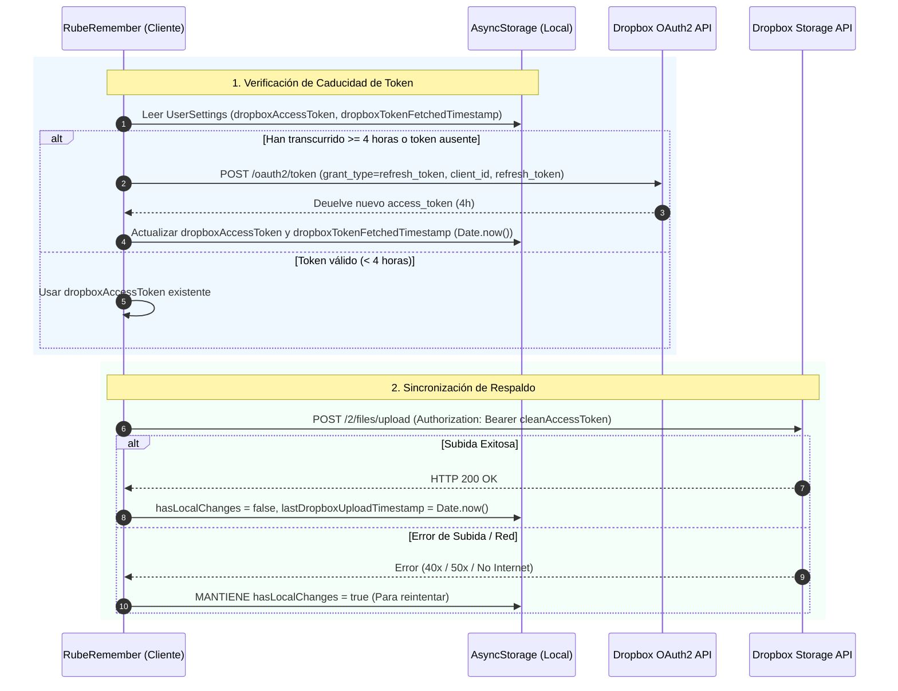

# ☁️ Infraestructura de Sincronización en la Nube (Dropbox OAuth 2.0)

Este documento describe la arquitectura, flujo de autenticación, esquema de rotación de respaldos y estrategias de resiliencia del sistema de sincronización en la nube de **RubeRemember**.

---

## 1. 🔐 Modelo de Autenticación OAuth 2.0 y Ciclo de Vida del Token

Dropbox utiliza tokens de acceso efímeros que **caducan a las 4 horas** ($14.400$ segundos). Para garantizar una sincronización continua e ininterrumpida sin requerir intervención manual del usuario, la infraestructura implementa el flujo de **Refresh Tokens**.



### Campos Guardados en `UserSettings`
- `dropboxRefreshToken`: Token permanente e ilimitado para solicitar tokens de acceso.
- `dropboxAppKey`: Client ID de la aplicación en Dropbox API Console.
- `dropboxAppSecret`: Clave secreta (opcional para clientes públicos móviles).
- `dropboxAccessToken`: Token temporal de acceso (de 4 horas).
- `dropboxTokenFetchedTimestamp`: Registro de tiempo (en milisegundos) del momento en que se renovó el token.
- `dropboxStorageBudgetMB`: Presupuesto de almacenamiento en MB (por defecto 1500, mínimo 50) usado para la rotación.
- `lastDropboxSnapshotFiles`: Lista de los nombres de archivo (texto + imágenes) de la **última subida exitosa**.
- `lastDropboxRestoredFiles` / `lastDropboxRestoreTimestamp`: Registro de la última restauración realizada desde la nube.

### Sanitización de Credenciales (`cleanToken`)
Toda clave o token ingresado o procesado pasa por la función `cleanToken`, eliminando comillas dobles (`"`), comillas simples (`'`) y espacios en blanco al inicio y final. Esto evita errores HTTP `401 Unauthorized` provocados por comillas accidentales al copiar/pegar credenciales.

### Seguridad en Exportaciones JSON (`exportBackupData`)
Para proteger las credenciales del usuario, el método `exportBackupData()` desinfecta automáticamente las llaves secretas y tokens, vaciando `dropboxAccessToken`, `dropboxRefreshToken`, `dropboxAppKey`, `dropboxAppSecret` y restableciendo `dropboxTokenFetchedTimestamp: 0` antes de generar el respaldo descargable.

---

## 2. 🔄 Esquema de Respaldo: Snapshots Pareados por *Timestamp* (*Paired Timestamp Snapshots*)

Para prevenir pérdidas de información por corrupción de datos o borrados accidentales, el sistema sube a Dropbox **un par de archivos con el mismo `timestamp`**, lo que permite restaurar tanto el texto de la base de datos como el bundle de imágenes asociado:

```
rube_remember_backup_<TS>.json     ← BD de texto (con referencias img_...)
rube_remember_images_<TS>.json     ← Bundle { id → dataUrl } de imágenes comprimidas
```

- **¿Por qué 2 archivos?**: Las imágenes se mantienen **fuera de la BD de texto** (esta vive en AsyncStorage, cuyo límite práctico en Android es ~6 MB). Almacenar los dataURLs en el JSON de texto lo habría reventado. Las imágenes se guardan como archivos en `documentDirectory/images/` con IDs `img_<uuid>` y la BD de texto solo guarda esos IDs; al subir, el bundle de imágenes acompaña a la BD con el mismo TS.
- **Qué ocurre en una subida (`performAutoSync`)**:
  1. `exportBackupDataSplit()` produce `{ text, images }` donde `text` es la BD con IDs y `images` mapea `id → dataUrl`.
  2. Se sube `rube_remember_backup_<TS>.json` (texto) y `rube_remember_images_<TS>.json` (imágenes).
  3. Tras subir, se evalúa el **presupuesto** de almacenamiento (`dropboxStorageBudgetMB`, por defecto **1500 MB**, mínimo 50): se listan los archivos remotos (`files/list_folder`), se agrupan por timestamp y se **borran los snapshots más antiguos** (`files/delete_v2`) hasta volver a estar dentro del presupuesto.
- **Restauración**: el sistema descarga ambos archivos del par elegido, escribe el bundle de imágenes en el directorio local e importa la BD (con `skipIntegrityGuard: true`, ya que es una decisión explícita del usuario).

### Compatibilidad con backups legacy
Los archivos antiguos `rube_remember_backup_1.json` … `rube_remember_backup_8.json` no tienen timestamp, por lo que se listan en la UI como **snapshots "legacy" individuales** y siguen siendo restaurables (no llevan bundle de imágenes).

---

## 3. ⚙️ Orquestador de Sincronización (`DropboxAutoSyncHandler`)

El componente `DropboxAutoSyncHandler` gestiona en segundo plano la lógica de subida automática bajo las siguientes reglas:

1. **Estado de Cambios Locales (`hasLocalChanges`)**:
   * Cualquier mutación local (crear/editar/completar tareas, hábitos o listas) marca `hasLocalChanges = true`.
2. **Frecuencia del Temporizador**:
   * Revisa las condiciones cada **30 minutos** mientras la aplicación permanece en primer plano (*active*). También se ejecuta al arrancar la app y al volver del segundo plano.
3. **Periodo de Enfriamiento (*Cooldown*)**:
   * Por defecto, exige **60 minutos (1 hora)** entre subidas para evitar saturación de red (configurable en ajustes).
4. **Protección contra Sobreescritura Vacía**:
   * Si la cantidad de tareas activas es `0`, el sistema aborta la subida en la nube para proteger la base de datos remota.
5. **Protección de Integridad de `Task.comments`**:
   * Si el sistema detecta una **pérdida masiva de comentarios/notas** comparando el estado local contra la última subida exitosa, **cancela la subida** (`reason: 'comments_lost'`) para no sobrescribir la copia buena de la nube con una base de datos corrupta.
   * Ver [cloud_integrity_guard.md](./cloud_integrity_guard.md) para el detalle completo de la doble capa de protección.
6. **Resiliencia y Reintentos**:
   * Si la subida falla por cualquier motivo (fallo de red, error de servidor o token expirado), **`hasLocalChanges` se mantiene en `true`**. En el siguiente ciclo o reconexión, la app reintentará subir la copia automáticamente.

---

## 4. 🖥️ Interfaz de Usuario y Depuración (`src/app/dropbox.tsx`)

La pantalla dedicada de **Dropbox** ofrece control visual y depuración en tiempo real:

- **Indicador de Tiempo Restante (en Verde)**: Ubicado justo debajo del campo *Access Token Actual*, muestra de forma clara el tiempo de vida restante del token (ejemplo: `✓ Tiempo de vida restante: 3h 45m`).
- **Control Manual de Renovación**: Botón *"Renovar Token"* para solicitar un nuevo token de acceso a voluntad mediante la API OAuth 2.0.
- **Gestor de Restauración**: Lista dinámica de los snapshots remotos (pareados por timestamp y legacy individuales) con botón *"Actualizar"* para refrescar la lista y acciones de **Restaurar** por snapshot. Al restaurar se descargan el archivo de texto y el bundle de imágenes pareado.
- **Card de Presupuesto**: Campo numérico para configurar `dropboxStorageBudgetMB` (MB) con botón de aplicar; valida un mínimo de 50 MB. Controla cuánto almacenamiento se conserva en la nube antes de rotar.
- **Subida Manual de Emergencia**: Botón *"Forzar Subida Manual Ahora"* que dispara `performAutoSync({ forceManual: true })`, subiendo la BD de texto y las imágenes pareadas y pasando también `exportBackupDataSplit`.
- **Debug Grid**: Panel interactivo con información técnica (AppState, Cooldown, Flag de cambios, conteo de tareas, presupuesto configurado).

---

## 5. 🖼️ Manejo de Imágenes (Fuera de la BD de Texto)

Para evitar superar el límite de ~6 MB de AsyncStorage en Android, las imágenes se almacenan como archivos comprimidos:

- **Almacenamiento local**: `saveDataUrl()` en `src/services/image-store.ts` comprime la imagen (redimensiona a máximo 1600 px y JPEG calidad 0.6 usando `ImageManipulator.manipulate` → `resize` → `renderAsync` → `saveAsync`) y la escribe en `documentDirectory/images/img_<uuid>.jpg`.
- **Referencias en la BD**: los campos `images?: string[]` guardan **IDs** (`img_...`), no dataURLs. `resolveImageUri(ref)` devuelve `file://.../images/<id>.jpg` para IDs, o pasa tal cual dataURLs/http/file URIs (comportamiento legacy).
- **Migración**: al cargar la base de datos, `materializeDatabaseImages()` convierte cualquier dataURL base64 antiguo a archivos con IDs (cubre tareas, sesiones, listas, memos, planes y comentarios).
- **En web**: `documentDirectory` es `null`, por lo que `saveDataUrl()` devuelve el dataURL sin cambios (sin persistencia local a archivos).

**Export / Import**
- `exportBackupData()` (manual, autocontenido): embebe los dataURLs en el JSON para que un solo archivo sea restaurable sin el bundle.
- `exportBackupDataSplit()` (Dropbox): devuelve `{ text, images }` para subir los 2 archivos pareados.
- `importBackupData(jsonString, imageBundle?)`: restaura la BD y, si se pasa el bundle de imágenes, escribe los archivos correspondientes antes de materializar.
