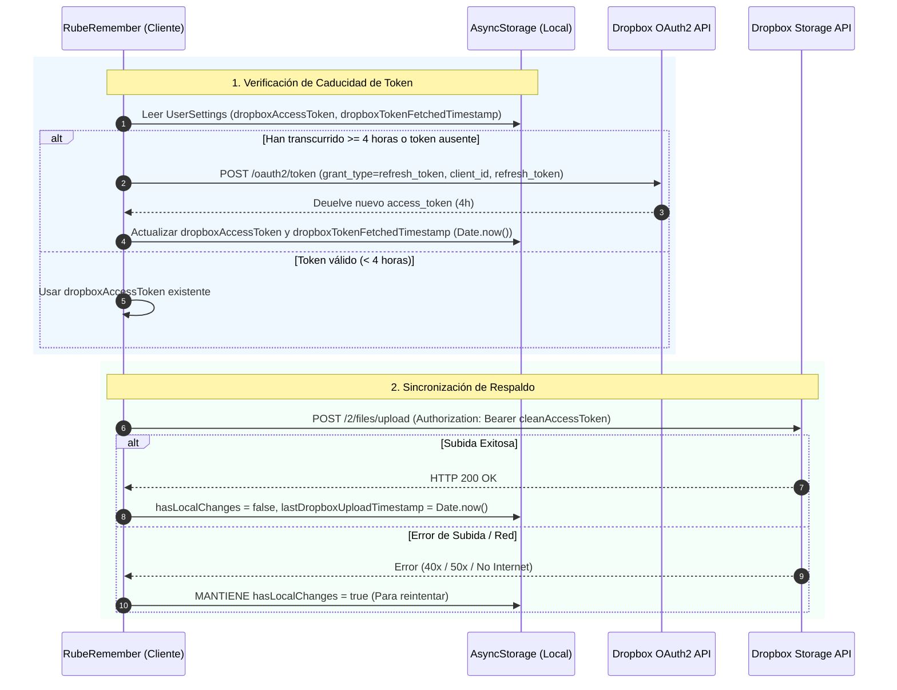

# ☁️ Infraestructura de Sincronización en la Nube (Dropbox OAuth 2.0)

Este documento describe la arquitectura, flujo de autenticación, esquema de rotación de respaldos y estrategias de resiliencia del sistema de sincronización en la nube de **RubeRemember**.

---

## 1. 🔐 Modelo de Autenticación OAuth 2.0 y Ciclo de Vida del Token

Dropbox utiliza tokens de acceso efímeros que **caducan a las 4 horas** ($14.400$ segundos). Para garantizar una sincronización continua e ininterrumpida sin requerir intervención manual del usuario, la infraestructura implementa el flujo de **Refresh Tokens**.



### Campos Guardados en `UserSettings`
- `dropboxRefreshToken`: Token permanente e ilimitado para solicitar tokens de acceso.
- `dropboxAppKey`: Client ID de la aplicación en Dropbox API Console.
- `dropboxAppSecret`: Clave secreta (opcional para clientes públicos móviles).
- `dropboxAccessToken`: Token temporal de acceso (de 4 horas).
- `dropboxTokenFetchedTimestamp`: Registro de tiempo (en milisegundos) del momento en que se renovó el token.

### Sanitización de Credenciales (`cleanToken`)
Toda clave o token ingresado o procesado pasa por la función `cleanToken`, eliminando comillas dobles (`"`), comillas simples (`'`) y espacios en blanco al inicio y final. Esto evita errores HTTP `401 Unauthorized` provocados por comillas accidentales al copiar/pegar credenciales.

### Seguridad en Exportaciones JSON (`exportBackupData`)
Para proteger las credenciales del usuario, el método `exportBackupData()` desinfecta automáticamente las llaves secretas y tokens, vaciando `dropboxAccessToken`, `dropboxRefreshToken`, `dropboxAppKey`, `dropboxAppSecret` y restableciendo `dropboxTokenFetchedTimestamp: 0` antes de generar el respaldo descargable.

---

## 2. 🔄 Esquema de Rotación de 7 Archivos (*Rotating 7-File Backup*)

Para prevenir pérdidas de información por corrupción de datos o borrados accidentales, el sistema utiliza un esquema de rotación circular de 7 ranuras (*slots*).

```
   [ Slot 1 ] ──> rube_remember_backup_1.json
   [ Slot 2 ] ──> rube_remember_backup_2.json
   [ Slot 3 ] ──> rube_remember_backup_3.json
   [ Slot 4 ] ──> rube_remember_backup_4.json
   [ Slot 5 ] ──> rube_remember_backup_5.json
   [ Slot 6 ] ──> rube_remember_backup_6.json
   [ Slot 7 ] ──> rube_remember_backup_7.json
```

- **Puntero de Slot (`lastDropboxSlotIndex`)**: Guarda el índice del último archivo subido (1 a 7).
- **Cálculo del Siguiente Slot**: Se calcula mediante `(lastSlotIndex % 7) + 1`.
- **Ventaja**: Garantiza que el usuario disponga siempre de los 7 respaldos más recientes en la nube para su libre restauración.

---

## 3. ⚙️ Orquestador de Sincronización (`DropboxAutoSyncHandler`)

El componente `DropboxAutoSyncHandler` gestiona en segundo plano la lógica de subida automática bajo las siguientes reglas:

1. **Estado de Cambios Locales (`hasLocalChanges`)**:
   * Cualquier mutación local (crear/editar/completar tareas, hábitos o listas) marca `hasLocalChanges = true`.
2. **Frecuencia del Temporizador**:
   * Revisa las condiciones cada **1 minuto** mientras la aplicación permanece en primer plano (*active*).
3. **Periodo de Enfriamiento (*Cooldown*)**:
   * Por defecto, exige **10 minutos** entre subidas para evitar saturación de red (configurable en ajustes).
4. **Protección contra Sobreescritura Vacía**:
   * Si la cantidad de tareas activas es `0`, el sistema aborta la subida en la nube para proteger la base de datos remota.
5. **Resiliencia y Reintentos**:
   * Si la subida falla por cualquier motivo (fallo de red, error de servidor o token expirado), **`hasLocalChanges` se mantiene en `true`**. En el siguiente ciclo o reconexión, la app reintentará subir la copia automáticamente.

---

## 4. 🖥️ Interfaz de Usuario y Depuración (`src/app/dropbox.tsx`)

La pantalla dedicada de **Dropbox** ofrece control visual y depuración en tiempo real:

- **Indicador de Tiempo Restante (en Verde)**: Ubicado justo debajo del campo *Access Token Actual*, muestra de forma clara el tiempo de vida restante del token (ejemplo: `✓ Tiempo de vida restante: 3h 45m`).
- **Control Manual de Renovación**: Botón *"Renovar Token"* para solicitar un nuevo token de acceso a voluntad mediante la API OAuth 2.0.
- **Gestor de Restauración**: Visualización de los 7 slots de respaldo con su antigüedad estimada e índice del último subido.
- **Debug Grid**: Panel interactivo con información técnica (AppState, Cooldown, Flag de cambios, conteo de tareas).
